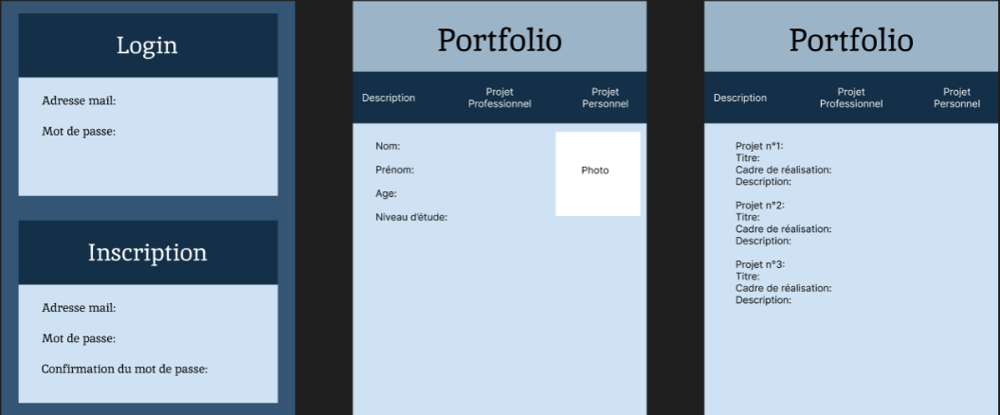
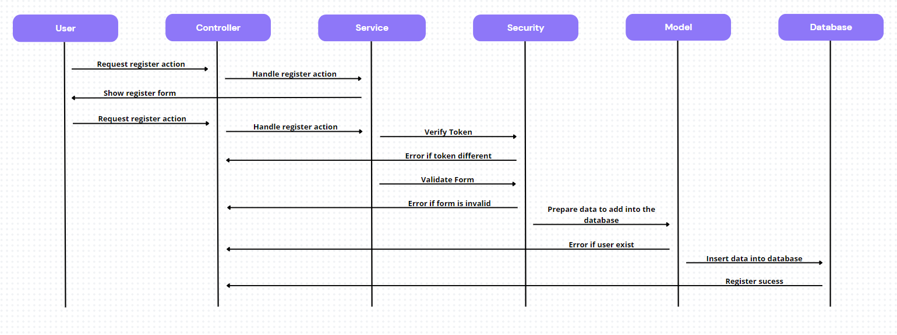

**1. Description Technique:**
Le développement du portfolio utilisera les versions les plus récentes d'HTML, CSS, PHP et MySQL. Le recours à JavaScript sera exclu pour ce projet.

---

**2. Description Fonctionnelle:**
Le portfolio intégrera les fonctionnalités suivantes (ajout d'autres si nécessaire) :
- **Gestion des utilisateurs CRUD (inscription, connexion, déconnexion, visualisation et modfication du profil, suppression du profil):**
- Le portfolio offrira une interface conviviale permettant aux utilisateurs de s'inscrire, de se connecter, de gérer leur profil, de visualiser
- les projets et de supprimer leur propre profil en toute simplicité.
- **Page affichant les projets réalisés (ou fictifs):** Une section dédiée présentera de manière claire et organisée les projets réalisés
- ou fictifs, mettant en valeur les compétences et réalisations du développeur.
- **Navigation entre les différentes sections du portfolio:** Une navigation intuitive sera mise en place pour permettre aux visiteurs de passer
- facilement d'une section à une autre, offrant ainsi une expérience fluide.
- **Formulaire de contact (non fonctionnel en local):** Bien que le formulaire de contact ne soit pas opérationnel en mode local, il sera présenté
-  de manière professionnelle, prêt à être activé lors de la mise en ligne du portfolio.

---

**3. Arborescence:**
Définition de l'arborescence des pages du portfolio.  
L'organisation des pages sera pensée de manière logique et intuitive,  
assurant une navigation facile pour les utilisateurs.  
L'arborescence comprendra les sections suivantes :

|-- Accueil (Présentation personnelle)  
|    
|-- Projets (Liste des projets réalisés)  
|  
|-- S'enregistrer (Formulaire d'inscription)  
|    
|-- Se connecter (Formulaire de connexion)   
|  
|-- Formulaire de contact (non fonctionnel en local à part si on passe par les serveurs de google)  
  
---

**4. Charte Graphique:**
La charte graphique du portfolio est définie comme suit :
- **Couleurs :** Utilisation des couleurs : #9CB4C8, #61819D, #CFE2F3, #345573, #143048

- **Police :** Roboto. https://fonts.google.com/specimen/Roboto

**5. Wireframe:**
Le maquettage du portfolio est définie comme suit :

Diagramme:

1. ***USECASE***  
     

**Explications :**  
a. **Cas d'utilisation principal : Se Connecter, S'enregistrer et Accéder au Tableau de Bord**
   - **Acteurs :** Utilisateur
   - **Description :** L'utilisateur a la possibilité de se connecter après s'enregistrer avec succès et est redirigé vers son tableau de bord.
   - **Scénario Principal :**
     1. L'utilisateur choisit l'option de s'enregistrer.
     2. Le système affiche le formulaire d'enregistrement.
     3. L'utilisateur entre les informations d'enregistrement.
     4. Le système vérifie et enregistre les informations d'utilisateur.
     5. Si l'enregistrement réussit, l'utilisateur est redirigé vers la page de connexion.
     6. L'utilisateur entre ses identifiants.
     7. Le système vérifie les informations d'identification.
     8. Si la connexion réussit, l'utilisateur est redirigé vers son tableau de bord.

b. **Cas d'utilisation inclus : Visualiser le Tableau de Bord**
   - **Acteurs :** Utilisateur
   - **Description :** L'utilisateur visualise les informations présentées sur son tableau de bord.
   - **Scénario Principal :**
     1. L'utilisateur est connecté.
     2. Le système affiche les informations pertinentes sur le tableau de bord.

c. **Cas d'utilisation étendu : Modifier le Profil depuis le Tableau de Bord**
   - **Acteurs :** Utilisateur
   - **Description :** L'utilisateur a la possibilité de modifier son profil directement depuis le tableau de bord.
   - **Scénario Principal :**
     1. L'utilisateur est connecté.
     2. Le système affiche les informations du tableau de bord.
     3. L'utilisateur choisit l'option de modification du profil.
   - **Scénario d'Extension :**
     - Si l'utilisateur choisit de modifier son profil depuis le tableau de bord, il étend le cas d'utilisation principal "Se Connecter et Accéder au Tableau de Bord".

***2.Diagramme d'activité***  
a. diagramme d'activité du système dans le cas d'un utilisateur déja enregistré.  
  
***3.Diagramme de séquence***  
  
***4.Diagramme de flux du système***
  
  
***5.ERD (Entity Relational Diagram)***  

